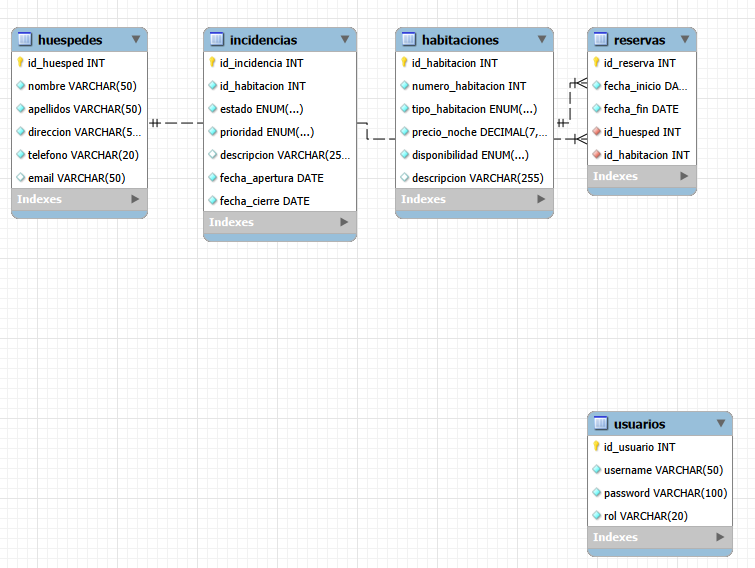

             # SpringHotelApp

## Descripción:
Aplicación web desarrollada con Spring MVC y Hibernate para la gestión de un hotel. Permite administrar habitaciones, huéspedes, reservas e incidencias, así como autenticación de usuarios con distintos roles (recepcionista y supervisor).

El sistema cubre operaciones CRUD completas y simula un entorno real de gestión hotelera con control de acceso según perfil.

-------------------------------------------------------------------------------------------------------------

## Requisitos previos:

- Java JDK 8+
- Apache Tomcat 9+
- MySQL 8.0
- Maven
- IDE (Eclipse)

-------------------------------------------------------------------------------------------------------------

## Instalación y despliegue:

1. Clonar el repositorio:

git clone https://github.com/PrimeraEdicionFlexible/ProyectoFinalEquipoL.git

-------------------------------------------------------------------------------------------------------------

## Creación de la BBDD:

ORDEN CORRECTO PARA EJECUTAR LOS SCRIPTS:

1 hoteldb_CREATE DATABASE.sql
2 hoteldb_usuarios.sql
3 hoteldb_huespedes.sql
4 hoteldb_habitaciones.sql
5 hoteldb_reservas.sql
6 hoteldb_incidencias.sql

Los scripts SQL se encuentran en la carpeta /sql del proyecto.

-------------------------------------------------------------------------------------------------------------

## Tecnologías utilizadas:

Java
Spring MVC
Hibernate
MySQL
JSP + JSTL
Apache Tomcat
Tareas adicionales: Log4j, BCrypt

-------------------------------------------------------------------------------------------------------------

## Estructura del proyecto:

Arquitectura en capas:

config          → configuración
controller      → gestión de peticiones HTTP
service         → lógica de negocio
exceptions      → excepciones personalizadas
model           → entidades JPA
repositories    → acceso a datos
view (JSP)      → interfaz de usuario

Separación de responsabilidades para seguir buenas prácticas.

-------------------------------------------------------------------------------------------------------------

## Estructura de ramas:

main → versión final estable
develop → integración
feature/* → desarrollo por funcionalidades

Ejemplos:

feature/setup
feature/sql
feature/habitaciones
feature/incidencias
feature/login
feature/huespedes
feature/reservas

-------------------------------------------------------------------------------------------------------------

## Flujo de trabajo:

Cada funcionalidad en rama feature/*
Pull Request a develop
Revisión por compañero
Merge a develop
Merge final a main

-------------------------------------------------------------------------------------------------------------

## Reparto de tareas:

A Javi → (ej: Habitaciones + Incidencias)
B Jorge → (ej: Huéspedes + Login)

## Conflictos de merge: ------------------> apuntar los que surjan

Se resolvieron conflictos principalmente en:

configuración de Spring ---------------> es un ejemplo, borrar luego
controladores compartidos -------------> es un ejemplo, borrar luego
ficheros JSP comunes ------------------> es un ejemplo, borrar luego

Resolución manual combinando cambios de los dos desarrolladores.

-------------------------------------------------------------------------------------------------------------

## Funcionalidades:

Login con roles (recepcionista / supervisor)
CRUD habitaciones
CRUD huéspedes
CRUD incidencias
CRUD reservas
Control de acceso por rol

-------------------------------------------------------------------------------------------------------------

## Credenciales de prueba:

recepcionista / recep123
supervisor / super123

-------------------------------------------------------------------------------------------------------------

## Documentación:

Ver carpeta /docs:

Proyecto (PDF)

- [proyecto (PDF)](docs/proyecto.pdf)